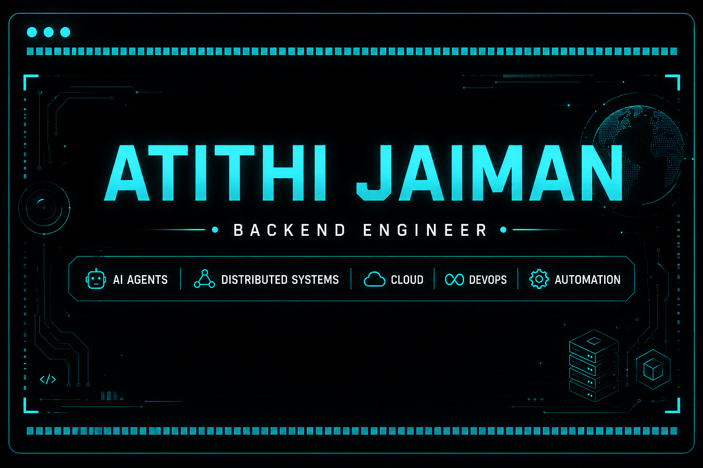

<!-- Banner (Optional)

-->

  

---

# 💫 About Me

I'm a Computer Science student at **IIIT Dharwad** passionate about building software that solves engineering problems at scale.

Rather than building simple CRUD applications, I enjoy designing **distributed systems**, **AI-powered applications**, and **production-ready backend architectures** with reliability, automation, and performance in mind.

---

# ⚡ Engineering Interests

- Distributed Systems
- Backend Architecture
- Systems Programming
- Linux & Networking
- Cloud Infrastructure
- DevOps
- Event-Driven Systems
- AI Agents
- Developer Tooling
---

# 🛠 Tech Stack

### Languages

### Backend

### AI

### Databases

### DevOps & Cloud

---

# 📊 GitHub Analytics

---

# 🌐 Connect With Me

---

### *""*

